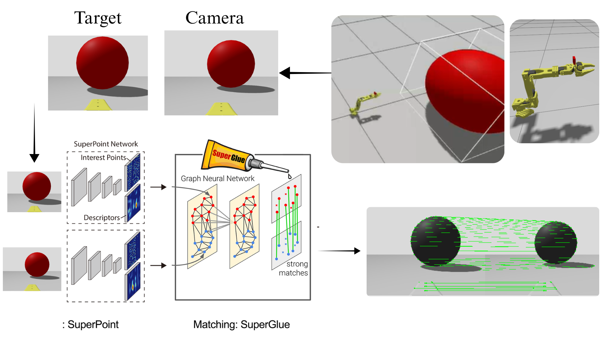

# ROS2 implementation of Image-Based Visual Servoing (IBVS) for the SO101

  

- Note : LeRobot SO-ARM101 integrated into ROS 2 Jazzy.

## Installation

- Clone the repository : `git clone hhttps://github.com/ErroujiOussama/so100-ibvs-vision-control`

### SO100 Gazebo Simulation 

- move to the package folder : `cd SO100_simulation/lerobot_ws`

- install dependencies using [rosdep](https://docs.ros.org/en/ros2_packages/rosdep.html):

`rosdep update`

`rosdep install --from-paths src --ignore-src -r -y`

- Build using : `colcon build`

- Visualising LeRobot SO101 in Rviz : `ros2 launch lerobot_description so101_display.launch.py`

**Video:**  
<!-- Add your video link here -->
https://github.com/user-attachments/assets/98f0a867-46c5-4661-8308-5de9e60a960b

- Gazebo and ROS 2 Control : 

`ros2 launch lerobot_description so101_gazebo.launch.py`  
`ros2 launch lerobot_controller so101_controller.launch.py`

**Video:**  
<!-- Add your video link here -->
https://github.com/user-attachments/assets/7d82b15c-8276-43b1-9b73-00b3567a5cf7

- Gazebo, ROS 2 Control and MoveIt : 

`ros2 launch lerobot_description so101_gazebo.launch.py`  
`ros2 launch lerobot_controller so101_controller.launch.py`  
`ros2 launch lerobot_moveit so101_moveit.launch.py`

- Settings: select "ompl" planning library for "arm" and "gripper" groups 

**Video: Arm**  

https://github.com/user-attachments/assets/f95e9fd7-272a-46a1-8b34-0cb6c3f36da8

**Video: Gripper**  

https://github.com/user-attachments/assets/5511c329-faad-4020-9527-4034f54a027a

### IBVS Control

---
## Credits

This project is based on [RobotStudio SO-ARM100](https://github.com/TheRobotStudio/SO-ARM100) and adheres to their license.

